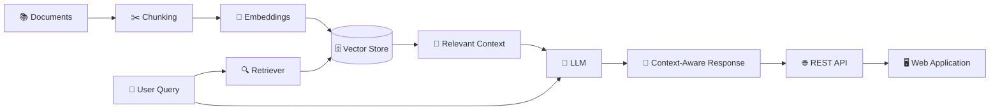

# ✨ Luma — A Living Library

<p align="center">
  
</p>

<p align="center">
  <strong>Ask. Learn. Explore. 🚀</strong>
</p>

<p align="center">
  A RAG-powered intelligent library that turns stored knowledge into something you can actually talk to.
</p>

<p align="center">
  <a href="https://github.com/aditya1236kumar/Luma--a-living-library">⭐ View on GitHub</a>
  ·
  <a href="#-features">Features</a>
  ·
  <a href="#-architecture">Architecture</a>
  ·
  <a href="#-getting-started">Getting Started</a>
</p>

---

## 🧠 What is Luma?

**Luma — A Living Library** is a **Retrieval-Augmented Generation (RAG)** based web application designed to make knowledge searchable, conversational, and useful.

Instead of simply storing documents and expecting users to hunt through them, Luma brings those documents into an AI-powered retrieval pipeline.

> **Store knowledge → retrieve the right context → generate a useful answer.**

Luma is also designed around a **REST API**, making the intelligence behind the library accessible to other applications and services.

---

## 🔥 Why "A Living Library"?

Traditional libraries store knowledge.

**Luma interacts with it.**

With RAG, your knowledge base becomes more than a collection of files. Users can ask questions in natural language and receive responses based on the relevant information retrieved from the library.

The goal is simple:

### 📚 Make your knowledge feel alive.

---

## ✨ Features

- 🤖 **RAG-powered question answering**
- 🔎 **Semantic knowledge retrieval**
- 📚 **Document-based knowledge library**
- 🧠 **Context-aware AI responses**
- 🌐 **REST API for integration**
- 💬 **Natural-language interaction**
- 🗂️ **Structured knowledge storage**
- 🚀 **Designed for future expansion**
- 🧩 **Clean separation between web, API, and AI functionality**

---

## 🏗️ Architecture

At a high level, Luma follows the RAG pattern:



### 🔄 The flow

1. **Documents enter the library**
2. Documents are split into useful chunks
3. Chunks are transformed into embeddings
4. Embeddings are stored for semantic retrieval
5. A user asks a question
6. Luma retrieves the most relevant context
7. The retrieved context is provided to the LLM
8. The LLM generates a context-aware response
9. The response is exposed through the application/API

This is the core idea behind Retrieval-Augmented Generation: **retrieve relevant knowledge first, then generate with that knowledge.**

---

## 🧩 Tech Stack

> Update the versions/dependencies below to match the exact implementation as the project evolves.

| Layer | Technology |
|---|---|
| 🎨 Frontend | HTML, CSS, JavaScript |
| ⚙️ Backend | Java |
| 🌱 Web/API | Spring Boot / REST |
| 🗄️ Database | MySQL |
| 🧠 AI Pattern | RAG |
| 🔗 Integration | REST API |
| 🛠️ Development | Git + GitHub |

---

## 🌐 REST API

One of Luma's important goals is to keep the intelligence accessible outside the UI.

That means another application could eventually communicate with Luma through HTTP instead of needing to know how the internal RAG pipeline works.

### Example request

```http
POST /api/query
Content-Type: application/json
```

```json
{
  "question": "What is Luma?"
}
```

### Example response

```json
{
  "answer": "Luma is a RAG-powered living library...",
  "sources": [
    {
      "title": "Luma Documentation"
    }
  ]
}
```

> **Note:** The exact endpoints and response schema should match the controllers implemented in the current source code.

---

## 🖼️ Project Visual

<p align="center">
  
</p>

---

## 🚀 Getting Started

### 1. Clone the repository

```bash
git clone https://github.com/aditya1236kumar/Luma--a-living-library.git
cd Luma--a-living-library
```

### 2. Configure your environment

Set the required database and AI/RAG configuration for your local environment.

**Never commit API keys or passwords to GitHub.**

A good approach is to keep secrets in environment variables or a local configuration file that is excluded through `.gitignore`.

### 3. Start the backend

Use the build/run command configured by the project.

For a Maven-based Spring Boot setup, this commonly looks like:

```bash
mvn spring-boot:run
```

### 4. Open the application

Once the backend is running, open the configured local web address in your browser.

---

## 📁 Project Structure

A clean structure for the growing project can look like:

```text
Luma--a-living-library/
│
├── src/
│   └── ...
│
├── assets/
│   ├── luma-hero.png
│   └── luma-showcase.png
│
├── .gitignore
├── README.md
└── ...
```

---

## 🎯 Project Goals

Luma is being built with a bigger vision than simply making another chatbot.

### Current direction

- [x] Build the core project foundation
- [ ] Connect the complete RAG pipeline
- [ ] Add robust document ingestion
- [ ] Improve semantic retrieval
- [ ] Expose clean REST endpoints
- [ ] Build a polished web interface
- [ ] Add source/citation visibility
- [ ] Improve error handling
- [ ] Add automated tests
- [ ] Add deployment configuration
- [ ] Make the knowledge base continuously extensible

---

## 🛣️ Roadmap

### 🌱 Phase 1 — Foundation
- Backend/API foundation
- Database integration
- Basic UI
- Initial knowledge model

### 🧠 Phase 2 — Intelligence
- Document ingestion
- Chunking
- Embeddings
- Vector retrieval
- RAG response generation

### 🌐 Phase 3 — API
- Query endpoints
- Document endpoints
- Health/status endpoints
- API documentation

### 🚀 Phase 4 — Production
- Authentication
- Rate limiting
- Better observability
- Automated testing
- Dockerization
- Cloud deployment

---

## 💡 What makes this project interesting?

Luma combines several areas of modern software engineering into one project:

**Full Stack Development**  
→ Build the interface users actually interact with.

**Backend Engineering**  
→ Design services and REST APIs.

**Databases**  
→ Persist and organize application knowledge.

**AI Engineering**  
→ Build a RAG pipeline instead of relying on a plain chatbot.

**API Design**  
→ Make the AI functionality reusable by other applications.

**System Design**  
→ Connect all of the above into one working product.

---

## 🤝 Contributing

Luma is built with the idea that good software gets better when people build together.

If you'd like to contribute:

```bash
git checkout -b feature/your-feature
```

Make your changes, test them, commit them, and open a pull request.

Ideas, improvements, bug fixes, documentation, and experiments are all welcome. 💜

---

## ⭐ Support the Project

If you find **Luma — A Living Library** interesting:

- ⭐ Star the repository
- 🍴 Fork it
- 🐛 Open an issue
- 💡 Suggest an improvement
- 🔧 Submit a pull request

Every star, issue, and contribution helps the project grow.

---

## 👨‍💻 Project

**Luma — A Living Library**

Built to explore the intersection of:

`RAG` · `AI` · `Java` · `REST APIs` · `Web Development` · `Databases`

<p align="center">

### 🌌 Knowledge shouldn't just be stored.

### It should be explored.

**Welcome to Luma. ✨**

</p>

---

<p align="center">
  <sub>Built with curiosity, code, and a lot of ☕</sub>
</p>
